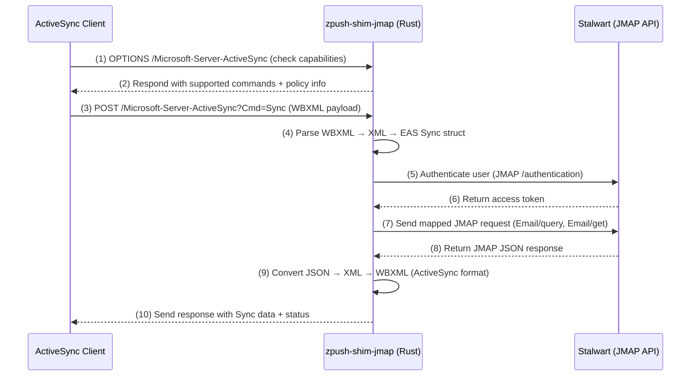

# zpush-shim-jmap Design Notes

## Overview

The **zpush-shim-jmap** project is a Rust-based replacement for the Java-based `zpush-shim`. Its purpose is to act as a lightweight protocol bridge between **ActiveSync clients** (e.g., iOS Mail, Android Mail, Outlook) and the **Stalwart Mail Server**, which natively supports JMAP. This enables full synchronization and mail flow on mobile devices without relying on Zimbra's deprecated SOAP/REST stack.

---

## Core Concept

```
ActiveSync client ⇄ zpush-shim-jmap ⇄ Stalwart (via JMAP)
```

The bridge translates ActiveSync commands (e.g., `Sync`, `SendMail`, `FolderSync`) into equivalent JMAP calls (`Email/query`, `Email/get`, `EmailSubmission/set`, etc.) and vice versa.

---

## Goals

* Provide a **fully open-source ActiveSync gateway** for Stalwart.
* Avoid any dependency on Zimbra or Java.
* Enable mobile clients that lack JMAP support to connect natively.
* Serve as a reference implementation for JMAP-to-EAS translation.

---

## Integration Models

### Option 1: Microservice Mode

A standalone Rust service that communicates with Stalwart over HTTP/JMAP.

**Pros:** Simpler to debug and deploy; isolated from core server.
**Cons:** Requires token-based communication.

**Example topology:**

```
ActiveSync → zpush-shim-jmap (Rust microservice) → Stalwart JMAP API
```

### Option 2: Embedded Mode

Integrate the shim directly within Stalwart (like `stalwart-cli`), using its internal JMAP crates.

**Pros:** No external HTTP calls, higher performance.
**Cons:** Tighter coupling to Stalwart's internal code structure.

**Recommended Path:** Start as a microservice, merge upstream later as an optional module.

---

## Mermaid Architecture Diagram

```mermaid
graph TD
    A[ActiveSync Client (iOS/Android/Outlook)] -->|ActiveSync XML/WBXML| B[zpush-shim-jmap (Rust)]
    B -->|Parse + Map| C[JMAP Request Builder]
    C -->|HTTP JSON| D[Stalwart Mail Server]
    D -->|JMAP Response| C
    C -->|Translate to ActiveSync| B
    B -->|WBXML Response| A
```

**Legend:**

* **A → B:** Mobile device uses ActiveSync protocol.
* **B → C → D:** Shim authenticates, converts request into JMAP, and relays to Stalwart.
* **D → A:** Response is returned as ActiveSync-compatible XML.

---

## Detailed Sequence Diagram (10-Step Flow)



---

## Proposed Directory Layout

```
zpush-shim-jmap/
├── Cargo.toml
├── src/
│   ├── main.rs              # Entrypoint
│   ├── server.rs            # HTTP listener for ActiveSync endpoints
│   ├── config.rs            # Configuration handling
│   ├── activesync/
│   │   ├── parser.rs        # WBXML/XML parsing
│   │   ├── response.rs      # Build ActiveSync XML responses
│   │   └── types.rs         # Structs/enums for ActiveSync operations
│   ├── jmap/
│   │   ├── client.rs        # JMAP API client (using jmap-client crate)
│   │   ├── mapper.rs        # Translate EAS ⇄ JMAP commands
│   │   └── auth.rs          # JMAP authentication/token management
│   └── logging.rs           # Tracing/logging setup
└── README.md
```

---

## Dependencies (Cargo.toml)

```toml
[dependencies]
tokio = { version = "1", features = ["macros", "rt-multi-thread"] }
hyper = { version = "1", features = ["server", "http1"] }
serde = { version = "1", features = ["derive"] }
serde_json = "1"
quick-xml = "0.31"
reqwest = { version = "0.12", features = ["json", "gzip"] }
jmap-client = "0.4"
config = "0.14"
tracing = "0.1"
```

---

## Request Flow Example

1. Client sends `POST /Microsoft-Server-ActiveSync?Cmd=Sync` request.
2. `zpush-shim-jmap` parses WBXML payload → internal ActiveSync struct.
3. Authenticate user via Stalwart JMAP endpoint.
4. Translate EAS command → JMAP JSON request.
5. Send JMAP request to Stalwart.
6. Convert JSON → XML → WBXML and return response.

**Command Mapping Examples:**

| ActiveSync Command | JMAP Equivalent         |
| ------------------ | ----------------------- |
| Sync               | Email/query + Email/get |
| SendMail           | EmailSubmission/set     |
| FolderSync         | Mailbox/get             |
| GetItemEstimate    | Email/query (filtered)  |

---

## Long-Term Extensions

* **CalDAV/CardDAV** translation for calendar/contacts sync.
* **Push synchronization** via Stalwart notification channels.
* **Caching layer** to minimize repeated JMAP queries.
* **Web-based admin console** for bridge management.
* **Benchmarking tools** to compare throughput vs Zimbra ActiveSync.

---

## Future Vision

Ultimately, `zpush-shim-jmap` could evolve into an official Stalwart extension, compiled as an optional module (`--with-activesync`), providing a complete mobile synchronization solution with zero Java dependencies.

The design intentionally mirrors the simplicity and portability of `stalwart-cli` — minimal footprint, fast startup, and clean configuration.

