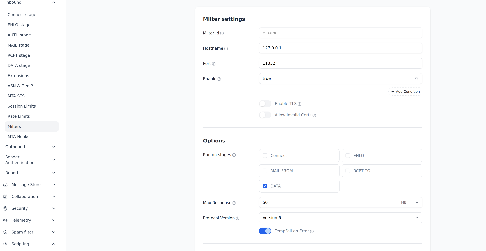

# Rspamd Deployment Guide for Stalwart Mail Server

## Preset ##
Create directory structure with the following:
```
% cp -r stalwart-rspamd /opt/
```
Next, add your passwords to: 
```
vi /opt/stalwart-rspamd/rspamd/local.d/worker-controller.inc
```
Read below for additional information.

## Overview

This guide covers deploying rspamd 3.9 as a milter service for spam filtering with Stalwart mail server. The configuration focuses on:

- Adding spam headers for client-side filtering (junk folders)
- **Preventing subject line rewriting** (no `*** SPAM ***` prefixes)
- Not rejecting mail at the MTA level (all decisions handled downstream)
- Proper integration with existing MX infrastructure

## Architecture

```
Internet → MX (Sendmail/Postfix) → Stalwart → Rspamd (milter)
```

Rspamd operates as a milter behind your MX server, scanning mail after it's been accepted and adding headers for filtering decisions.

## Docker Compose Setup

Create a `docker-compose.yml` file:

```yaml
version: "3.9"
services:
  redis:
    image: redis:7
    container_name: redis
    restart: unless-stopped
    volumes:
      - redis-data:/data
  
  rspamd:
    image: rspamd/rspamd:3.9.0
    container_name: rspamd
    depends_on:
      - redis
    restart: unless-stopped
    ports:
      - "11334:11334"   # Web UI
      - "11332:11332"   # Milter
      - "11333:11333"   # Controller API
    volumes:
      - ./rspamd:/etc/rspamd
      - rspamd-data:/var/lib/rspamd

volumes:
  redis-data:
  rspamd-data:
```

Start the containers:

```bash
docker compose up -d
```

## Critical Configuration Files

### Directory Structure

```
rspamd/
├── local.d/
│   ├── actions.conf
│   ├── milter_headers.conf
│   ├── redis.conf
│   ├── options.inc
│   └── worker-controller.inc
└── override.d/
    └── force_actions.conf
```

### 1. Action Thresholds (`local.d/actions.conf`)

**CRITICAL**: Rspamd requires action thresholds to follow strict ordering:
```
greylist < add_header < rewrite_subject < soft_reject < reject
```

Configuration:

```conf
# /rspamd/local.d/actions.conf
# Maintain required ordering
greylist = 4;
add_header = 6;
rewrite_subject = 15;  # Kept for ordering but disabled via force_actions
reject = 1000;         # Effectively disabled (very high threshold)
```

**Important Notes:**
- `add_header = 6` triggers X-Spam headers for messages scoring 6+
- `reject = 1000` effectively disables rejection (passes everything through)
- `greylist = 4` is mostly informational in milter mode behind an MX
- **Do NOT wrap in `actions { }` block** - the filename defines the section

### 2. Milter Headers (`local.d/milter_headers.conf`)

**CRITICAL**: The `all = true` setting causes ALL headers including subject rewriting to be added. It must be removed.

Configuration:

```conf
# /rspamd/local.d/milter_headers.conf
extended_spam_headers = true;
use = [
  "x-spamd-result",
  "x-spamd-bar",
  "x-rspamd-server",
  "x-rspamd-queue-id",
  "x-spam-status",
  "authentication-results"
];
# DO NOT include: all = true
# DO NOT include: add = true
# Notably absent from use array: "spam-header" (which does subject rewriting)
```

**What this does:**
- Only adds the headers explicitly listed in the `use` array
- Excludes the "spam-header" module that rewrites subjects
- Provides necessary headers for client-side filtering

### 3. Force Actions Override (`override.d/force_actions.conf`)

**CRITICAL**: This is the final safety net that prevents subject rewriting if it somehow gets triggered.

Configuration:

```conf
# /rspamd/override.d/force_actions.conf
rules {
  never_rewrite_subject {
    priority = 10000;
    expression = "SCORE >= -999";
    action = "add header";
    require_action = ["rewrite subject"];
  }
}
```

**What this does:**
- Intercepts any "rewrite subject" action
- Converts it to "add header" instead
- High priority (10000) ensures it runs first
- Applies to all messages (SCORE >= -999 is always true)

### 4. Redis Configuration (`local.d/redis.conf`)

```conf
# /rspamd/local.d/redis.conf
servers = "redis:6379";
```

### 5. Trusted Networks (`local.d/options.inc`)

**IMPORTANT**: Configure your MX servers as trusted so rspamd checks the original sender, not your relay.

```conf
# /rspamd/local.d/options.inc
local_addrs = [
  "127.0.0.0/8",
  "::1",
];

# Add all your MX server IPs here
trusted_networks = [
  "127.0.0.0/8",
  "::1",
  "192.168.1.10",    # Example: relay1.example.com
  "192.168.1.11",    # Example: relay2.example.com
  # Add your actual MX IPs
];
```

**Why this matters:**
- Without this, rspamd checks SPF/DKIM against your relay instead of the original sender
- Incorrect reputation scoring
- Potential false positives

### 6. Web UI Password (`local.d/worker-controller.inc`)

Generate a password hash:

```bash
docker exec rspamd rspamadm pw
```

Then create the file:

```conf
# /rspamd/local.d/worker-controller.inc
password = "$2$your_generated_hash_here";
```

## Configuration Testing and Reloading

### The Correct Workflow

**CRITICAL**: Always use `--reload` for configuration changes, NOT `--restart`.

After making configuration changes:

```bash
# 1. Test configuration syntax
./rspamd-ctl.sh --test

# 2. If test passes, reload (NO restart needed)
./rspamd-ctl.sh --reload

# 3. Verify the config was loaded
./rspamd-ctl.sh --doctor
```

### When to Use Each Command

**Use `--reload` (99% of the time):**
- After editing any configuration file
- To apply new settings without downtime
- When force_actions stops working
- After updating action thresholds

**Use `--restart` (rarely):**
- Container is crashed/broken
- Changes to docker-compose.yml
- After clearing Redis (`--clear-redis` does this automatically)
- As a last resort when reload doesn't work

**Use `--doctor`:**
- To diagnose configuration problems
- After reload to verify settings applied
- When emails aren't being filtered correctly
- When subject rewriting starts happening

### Verification Commands

```bash
# Check action thresholds
./rspamd-ctl.sh --actions

# Verify milter headers
./rspamd-ctl.sh --headers

# Verify force actions (subject rewrite protection)
./rspamd-ctl.sh --force-actions

# Run complete health check
./rspamd-ctl.sh --doctor
```

## Common Issues and Solutions

### Issue 1: Subject Lines Still Being Rewritten

**Symptom**: Emails show `*** SPAM ***` in subject despite configuration

**Causes**:
1. `all = true` in `milter_headers.conf` (overrides your `use` array)
2. Missing `force_actions.conf` file
3. Configuration not reloaded after changes

**Solution**:
```bash
# Check current milter_headers config
docker exec rspamd rspamadm configdump milter_headers

# Should NOT show "all = true" or "add = true"

# Check force_actions is loaded
docker exec rspamd rspamadm configdump force_actions

# Should show the never_rewrite_subject rule

# Reload if needed
docker exec rspamd rspamadm control reload
```

### Issue 2: Configuration File Syntax Errors

**Symptom**: Container crash-loops or won't start

**Cause**: Nested sections (e.g., wrapping `actions.conf` content in `actions { }`)

**Solution**:
- Files in `local.d/` and `override.d/` automatically create sections based on filename
- Put key-value pairs directly in the file without outer braces

**Incorrect** (`local.d/actions.conf`):
```conf
actions {
  reject = 1000;
  add_header = 6;
}
```

**Correct** (`local.d/actions.conf`):
```conf
reject = 1000;
add_header = 6;
```

### Issue 3: Web UI Shows Wrong Thresholds

**Symptom**: GUI displays different values than your configuration (e.g., reject=33 instead of 1000)

**Cause**: Old settings stored in Redis override file-based configuration

**Solution**:
```bash
# Clear Redis database
docker exec redis redis-cli FLUSHDB

# Restart rspamd
docker restart rspamd

# Wait for startup, then reload config
docker exec rspamd rspamadm control reload
```

**IMPORTANT**: After clearing Redis, always reload your configuration to ensure all settings are applied.

### Issue 4: Action Threshold Ordering Violations

**Symptom**: Configuration test fails with ordering errors

**Cause**: Thresholds don't follow required order: `greylist < add_header < rewrite_subject < reject`

**Solution**: Adjust your thresholds to maintain proper ordering while keeping unwanted actions at high values.

## Rspamd Control Script

Instead of typing long `docker exec` commands, create a control script for common operations.

### Script Installation

Create `~/rspamd-ctl.sh`:

```bash
#!/bin/bash
# Rspamd Docker Control Script

COMPOSE_DIR="/opt/stalwart-rspamd"  # UPDATE THIS PATH

cd "$COMPOSE_DIR" || exit 1

case "$1" in
    --start|start)
        echo "Starting rspamd and redis..."
        docker compose up -d
        ;;
    --stop|stop)
        echo "Stopping rspamd and redis..."
        docker compose down
        ;;
    --restart|restart)
        echo "Restarting rspamd..."
        docker restart rspamd
        ;;
    --reload|reload)
        echo "Reloading rspamd configuration..."
        docker exec rspamd rspamadm control reload
        ;;
    --status|status)
        echo "Container status:"
        docker ps --filter "name=rspamd" --filter "name=redis"
        echo ""
        echo "Rspamd workers:"
        docker exec rspamd rspamadm control stat
        ;;
    --logs|logs)
        if [ -z "$2" ]; then
            docker logs rspamd --tail 50 -f
        else
            docker logs rspamd --tail "$2"
        fi
        ;;
    --test|test)
        echo "Testing configuration..."
        docker exec rspamd rspamadm configtest
        ;;
    --actions|actions)
        echo "Current action thresholds:"
        docker exec rspamd rspamadm configdump actions
        ;;
    --headers|headers)
        echo "Current milter_headers config:"
        docker exec rspamd rspamadm configdump milter_headers
        ;;
    --force-actions|force-actions)
        echo "Current force_actions config:"
        docker exec rspamd rspamadm configdump force_actions
        ;;
    --clear-redis|clear-redis)
        echo "WARNING: This will clear all Redis data!"
        read -p "Are you sure? (yes/no): " confirm
        if [ "$confirm" = "yes" ]; then
            docker exec redis redis-cli FLUSHDB
            docker restart rspamd
            echo "Waiting for rspamd to start..."
            sleep 3
            docker exec rspamd rspamadm control reload
            echo "Redis cleared, rspamd restarted, and config reloaded"
        else
            echo "Cancelled"
        fi
        ;;
    --shell|shell)
        docker exec -it rspamd /bin/sh
        ;;
    --redis-shell|redis-shell)
        docker exec -it redis redis-cli
        ;;
    --help|help|-h|"")
        echo "Rspamd Control Script"
        echo ""
        echo "Usage: $0 [--command]"
        echo ""
        echo "Commands:"
        echo "  --start            - Start rspamd and redis containers"
        echo "  --stop             - Stop rspamd and redis containers"
        echo "  --restart          - Restart rspamd container"
        echo "  --reload           - Reload rspamd configuration (no downtime)"
        echo "  --status           - Show container and worker status"
        echo "  --logs [lines]     - Show rspamd logs (default: tail 50 and follow)"
        echo "  --test             - Test configuration for errors"
        echo "  --actions          - Show current action thresholds"
        echo "  --headers          - Show milter_headers configuration"
        echo "  --force-actions    - Show force_actions configuration"
        echo "  --clear-redis      - Clear Redis database (removes dynamic settings)"
        echo "  --shell            - Open shell in rspamd container"
        echo "  --redis-shell      - Open Redis CLI"
        echo "  --help, -h         - Show this help message"
        echo ""
        echo "Note: Commands work with or without '--' prefix"
        echo ""
        echo "Examples:"
        echo "  $0 --reload            # Reload config after changes"
        echo "  $0 reload              # Same as above"
        echo "  $0 --logs 100          # Show last 100 log lines"
        echo "  $0 --test              # Verify config is valid"
        echo "  $0 --clear-redis       # Clear Redis and reload config"
        ;;
    *)
        echo "Unknown command: $1"
        echo "Use '$0 --help' to see available commands"
        exit 1
        ;;
esac
```

Make it executable:

```bash
chmod +x ~/rspamd-ctl.sh
```

**Update the `COMPOSE_DIR` variable** to match your installation path.

### Common Usage Examples

```bash
# MOST COMMON: After changing configuration files
./rspamd-ctl.sh --test     # Check syntax
./rspamd-ctl.sh --reload   # Apply changes
./rspamd-ctl.sh --doctor   # Verify everything works

# Diagnose any issues
./rspamd-ctl.sh --doctor

# Check if everything is running
./rspamd-ctl.sh --status

# View recent logs
./rspamd-ctl.sh --logs

# View more log lines
./rspamd-ctl.sh --logs 200

# See current action thresholds
./rspamd-ctl.sh --actions

# See milter headers configuration
./rspamd-ctl.sh --headers

# Verify force_actions is loaded (prevents subject rewriting)
./rspamd-ctl.sh --force-actions

# Clear Redis and reload config (troubleshooting)
./rspamd-ctl.sh --clear-redis

# Interactive shell in rspamd container
./rspamd-ctl.sh --shell

# Redis CLI access
./rspamd-ctl.sh --redis-shell
```

### Important Workflow Reminders

**After editing ANY config file:**
```bash
./rspamd-ctl.sh --test && ./rspamd-ctl.sh --reload
```

**If subject rewriting starts happening:**
```bash
./rspamd-ctl.sh --doctor           # Diagnose the issue
./rspamd-ctl.sh --force-actions    # Check if rule is loaded
./rspamd-ctl.sh --reload           # Reload config
```

**If emails are delayed:**
```bash
./rspamd-ctl.sh --actions          # Check greylist threshold
# Should show: greylist = 1000
```

## Verifying Correct Operation

### Expected Spam Email Headers

When rspamd is working correctly, spam emails should have these headers:

```
X-Rspamd-Pre-Result: action=add header;
    module=force_actions;
    unknown reason
X-Spamd-Bar: ++++++++++++
X-Rspamd-Server: <container_id>
X-Spam-Status: Yes, score=12.10
X-Spamd-Result: default: False [12.10 / 6.00];
    <spam detection rules and scores>
FORCE_ACTION_never_rewrite_subject(0.00)[add header];
```

**Key indicators of correct operation:**
- ✅ `X-Rspamd-Pre-Result: action=add header` (not "rewrite subject")
- ✅ `FORCE_ACTION_never_rewrite_subject` present in the result
- ✅ Subject line is **unchanged** (no `*** SPAM ***` prefix)
- ✅ X-Spam headers present for filtering

### What Should NOT Appear

If you see any of these, configuration needs adjustment:

- ❌ `X-Rspamd-Action: rewrite subject`
- ❌ Subject line starting with `*** SPAM ***`
- ❌ Missing `FORCE_ACTION_never_rewrite_subject` in headers
- ❌ Email rejected by rspamd (should never happen with reject=1000)

## Web UI Access

Access the web interface at: `http://your-server:11334`

Login with the password configured in `worker-controller.inc`.

**Important**: 
- Do NOT change action thresholds through the web UI
- GUI changes are stored in Redis and override your file-based configuration
- Always edit configuration files and reload instead

## Maintenance Tasks

### Regular Operations

```bash
# After any config file changes
~/rspamd-ctl.sh --test
~/rspamd-ctl.sh --reload

# Check logs for errors
~/rspamd-ctl.sh --logs 100

# Verify configuration is applied
~/rspamd-ctl.sh --actions
~/rspamd-ctl.sh --headers
~/rspamd-ctl.sh --force-actions
```

### Troubleshooting Workflow

1. **Run health check**:
   ```bash
   ./rspamd-ctl.sh --doctor
   ```
   This checks:
   - Container status
   - Configuration syntax
   - Action thresholds
   - Force actions rule
   - Milter headers settings
   - Redis state
   - Recent errors

2. **Review recent logs**:
   ```bash
   ./rspamd-ctl.sh --logs 200
   ```

3. **Verify specific configurations**:
   ```bash
   ./rspamd-ctl.sh --actions
   ./rspamd-ctl.sh --headers
   ./rspamd-ctl.sh --force-actions
   ```

4. **Check Redis for interference**:
   ```bash
   docker exec redis redis-cli KEYS "*"
   ```

5. **If needed, clear Redis and reload**:
   ```bash
   ./rspamd-ctl.sh --clear-redis
   ```

### Subject Rewriting Suddenly Started Again

**Symptoms**: Emails getting `*** SPAM ***` in subject after it was working

**Diagnosis**:
```bash
./rspamd-ctl.sh --doctor
```

Look for:
- `✗ Force actions rule NOT found`
- `✗ WARNING: 'all = true' is set`

**Common Causes**:
1. Used `docker restart` instead of `--reload` after config changes
2. Redis cache overriding file configuration
3. force_actions.conf file missing or not loaded

**Solution**:
```bash
# Verify force_actions.conf exists
cat ./rspamd/override.d/force_actions.conf

# If missing, recreate it (see configuration section above)

# Reload configuration
./rspamd-ctl.sh --reload

# Verify it loaded
./rspamd-ctl.sh --force-actions

# Should show: never_rewrite_subject rule

# Run health check
./rspamd-ctl.sh --doctor
```

### Emails Arriving with 5-Minute Delays

**Cause**: Greylist threshold set too low

**Check**:
```bash
./rspamd-ctl.sh --actions
# Look for: greylist = 5 (or any value < 1000)
```

**Solution**: Set greylist to 1000 (see Action Thresholds section)

### Configuration Changes Not Taking Effect

**Common Mistake**: Using `docker restart` instead of `--reload`

**Solution**:
```bash
# After ANY config file change:
./rspamd-ctl.sh --test
./rspamd-ctl.sh --reload   # NOT --restart!
./rspamd-ctl.sh --doctor
```

## Integration with Stalwart


## Additional Resources

- [Rspamd Documentation](https://rspamd.com/doc/)
- [Rspamd Configuration](https://rspamd.com/doc/configuration/)
- [Milter Headers Module](https://rspamd.com/doc/modules/milter_headers.html)
- [Force Actions Module](https://rspamd.com/doc/modules/force_actions.html)

## Summary

This configuration provides:
- ✅ Effective spam detection and scoring
- ✅ Header-based filtering (X-Spam-Status for client-side rules)
- ✅ **No subject line modification**
- ✅ No mail rejection (all filtering decisions downstream)
- ✅ Proper integration with existing MX infrastructure
- ✅ Easy management via control script

The key to preventing subject rewriting is the **two-layer approach**:
1. **milter_headers.conf** without `all = true` (prevents module from being loaded)
2. **force_actions.conf** override (safety net if action is triggered)

Both layers are necessary for reliable operation.

## Critical Best Practices

### Configuration Changes Workflow

**ALWAYS follow this pattern:**

```bash
# 1. Edit your config file
nano ./rspamd/local.d/actions.conf

# 2. Test for syntax errors
./rspamd-ctl.sh --test

# 3. Reload (NOT restart!)
./rspamd-ctl.sh --reload

# 4. Verify it worked
./rspamd-ctl.sh --doctor
```

### Common Mistakes to Avoid

❌ **WRONG**: Using `docker restart rspamd` after config changes
```bash
# This can cause caching issues and config loss
docker restart rspamd
```

✅ **RIGHT**: Using `--reload` after config changes
```bash
# This applies changes without issues
./rspamd-ctl.sh --reload
```

❌ **WRONG**: Changing thresholds in the Web UI
```bash
# Web UI saves to Redis, which overrides your files
```

✅ **RIGHT**: Edit config files and reload
```bash
nano ./rspamd/local.d/actions.conf
./rspamd-ctl.sh --reload
```

❌ **WRONG**: Wrapping config in section blocks
```conf
# local.d/actions.conf (WRONG)
actions {
  reject = 1000;
}
```

✅ **RIGHT**: Direct key-value pairs
```conf
# local.d/actions.conf (RIGHT)
reject = 1000;
```

### Monitoring and Verification

Run health checks regularly:
```bash
./rspamd-ctl.sh --doctor
```

Check headers of incoming spam to verify:
- `FORCE_ACTION_never_rewrite_subject` is present
- Subject is not modified
- `X-Spam-Status` header is added at correct threshold

### Emergency Recovery

If everything stops working:

```bash
# 1. Run diagnostics
./rspamd-ctl.sh --doctor

# 2. Check logs for errors
./rspamd-ctl.sh --logs 200

# 3. Clear Redis if needed
./rspamd-ctl.sh --clear-redis

# 4. Verify configs loaded
./rspamd-ctl.sh --force-actions
./rspamd-ctl.sh --actions
./rspamd-ctl.sh --headers
```
